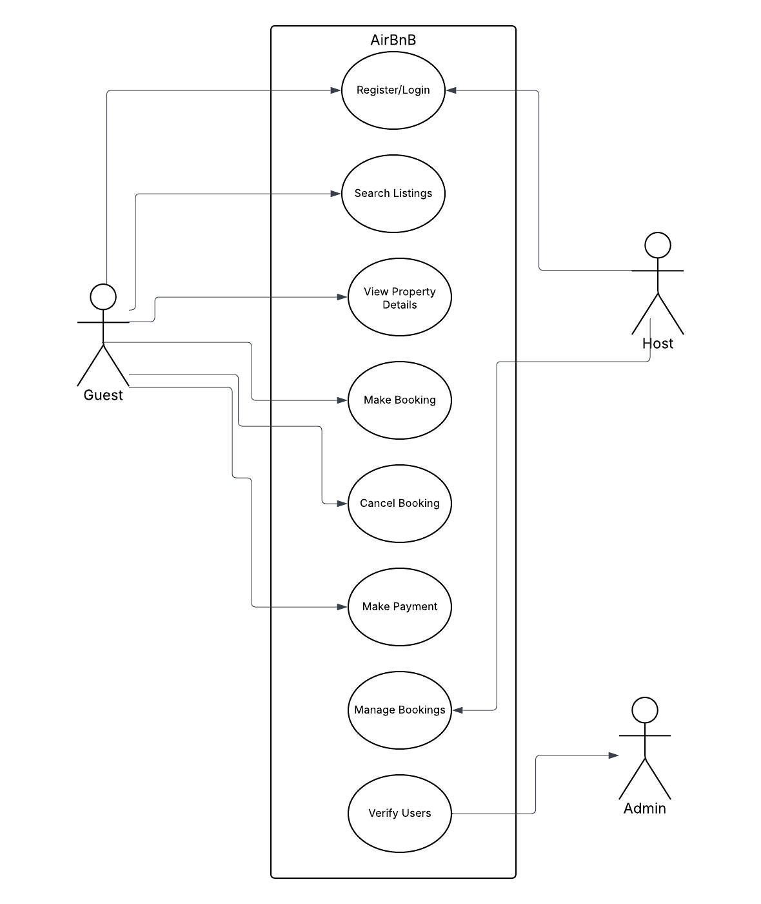

# requirement-analysis

---

# Requirement Analysis in Software Development

This repository serves as a comprehensive guide and working project on **Requirment Analysis**- a foundational phase in the Software Development Lifecycle (SDLC). Focusing on the AirBnB Clone case study, it demonstrates how to identify, document, and structure both functional and non-functional requirements.

---

## What is Requirement Analysis?

Requirement Analysis is a critical phase in the software development lifecycle (SDLC) where the project team gathers, analyzes, and defines the requirements of the software product to be developed. This process ensures that all stakeholders have a clear and mutual understanding of what the system should do and how it should perform.

### Importance of Requirements Analysis in SDLC
1. **Foundation for Development** - Requirement analysis provided the blueprint for what needs to be built. Without a clear understanding of the system's purpose and scope, the software may not solve the intended problems or meet user expectations.
2. **Reduce Cost and Rework** - Identifying requirements early helps catch inconsistencies, ambiguities, or misunderstandings before development begins. Changes made during the analysis phase are far less costly than those made during development or after deployment.
3. **Drived Design and Testing** - Well-defined requirements influence system architecture and guide test case development. Acceptance criteria derived from requirements ensure that testing aligns with business needs.

---

## Why is Requirement Analysis Important?

1. **Clarity and Understanding** - It helps in understanding what the stakeholders expect from the software, reducing ambiguity.
2. **Scope Definition** - Clearly defines the scope of the project, which helps in preventing scope creep.
3. **Basis for Design and Development** - Provides a solid foundation for designing and developing the system.
4. **Cost and Time Estimation** - Facilitates accurate estimation of project cost, resources, and time.
5. **Quality Assurance** - Ensures that the final product meets the specified requirements, leading to higher customer satisfaction.

---

## Key Activities in Requirement Analysis

Each activity in the Requirement Analysis process plays a crucial role in capturing and validating software requirements.

### 1. Requirements Gathering

  - This is the process of identifying the needs, expectations, and constraints of stakeholders for a new or modified system. It serves as the entry point into requirements analysis. It aims to answer questions like:
    - What does he user want the system to do?
    - What problem is the system expeted to solve?
    - What are the constraints or rules that the system must follow?
    - Who are the users and what are their goals
  - Techniques used in requirement gathering include:
    - Interviews
    - Surveys & questionnaires
    - Workshops & focus groups
    - Observation
    - Document analysis
   
### 2. Requirement Elicitation

  - In this activity, there is deeper focus on working out the detailed requirements from stakeholders through direct interaction and exploration.
  - The goals include capturing detailed, accurate, and complete requirments, clarify expectations and usage scenarios, and identify hidden or implicit needs.
  - Techniques used include brainstorming, focus groups, and prototyping.
   
### 3. Requirement Documentation 

  - This activity involves formalizing the elicited requirments in a clear, organized, and structured format.It ensures that there is a shared understanding between developers, testers, and stakeholders. It also provides a basis for system design, implemntation, and testing.
  - Items used in this activity include **Software Requirement Specification (SRS)**, **User Stories**, and diagrams such as **Entity-Relationships**.
  
### 4. Requirement Analysis and Modeling

  - This is the process of examining requirements for clarity, consistency, completeness, and feasibility.
  - The aim is to detect and resolve incosistencies, identify functional dependencies and priorities, and translate textual requirements into visual representations.
  - Techniques used include use case diagrams and Entity-Relationship Diagrams.

### 5. Requirement Validation
  - This activity ensures that the documented requirements accurately represent the stakeholder's needs and are feasible, testable, and aligned with business objectives.
  - The goal is to confirm stakholder agreement and approval and verify correctness

---

## Types of Requirements

Requirements define what a software system should do, how it should behanve, and the constraints under which it must operate.

### Functional Requirements

Functional requirements describe what the system should do. They define the core functions, features, and behavior of the software in response to specific inputs or user interactions.

Examples of functional requirements
  - The system should allow users to create and manage bookings.
  - The system should allow a user to search for properties based on various criteria such as location, price, and availabilty.
  - The user should provide secure login and registration process for users.
  - The application must send a confirmation email after a successful payment.

### Non-Functional Requirements

Non-Functional Requirements describe how the system performs rather than what it does. These requirements relate to quality attributes, performance, security, and usability.

**Examples of functinal requirements**
  - The system should respond to user requests within 2 seconds.
  - The software must support at least 1000 concurrent users.
  - Data must be encryped during transfer and also in storage.

Non-Functional requirements can be categorized into the following:
  - **Performance**: Speed, response time, throughput
  - **Scalability**: Ability to handle growing user loads
  - **Security**: Authentication, data protection, access control
  - **Usability**: User interface consistency, ease of use
  - **Reliability & Availability**: Uptime, fault tolerance
  - **Maintainability**: Ease of updating, modular structure
  - **Portability**: Ability to run on various platforms or devices

---

## Use Case Diagrams

A Use Case Diagram is a visual representation of a system's functionality from the user's perspective. It helps model how actors interact with the system and what the goals (use cases) they achieve.

**Benefits of Use Case Diagrams**

- Provide a clear visual representation of system functionalities.
- Help in identifying and organizing system requirements.
- Facilitate communication among stakeholders and development team.

**Actors in our AirBnB project**
1. Guest
2. Host
3. Admin

---

## Acceptance Criteraia

Acceptance Criteria are a set of predefined conditions that a software feature or functionality must meet to be considered complete and acceptable by the product owner, client, or end user.

**Importance of Acceptance Criteria**

  - **Clarity of Scope**: Clearly defines what needs to be delivered for a requirement to be "done".
  - **Basis for Testing**: Guides testers in creating test cases for verification and validation.
  - **Improved Communication**: Aligns understanding between developers, clients, and QA teams.
  - **Reduces Ambiguity**: Eliminates assumptions or vague requirements.

**Example of Acceptance Criteria For Checkout Feature in Booking Management System**

**Scenario**: User attempts to checkout without logging in
  Given the user is not logged in
  When the user attemtps to proceed to checkout
  Then the system should redirect the user to the login page

**Scenario**: Booking summary is displayed at checkout
  Given the user is on the checkout page
  Then the system should display the selected property details
  And show the check-in and check-out dates
  And display the total cost including feed and taxes

**Scenario**: User enters invalid or incomplete paymen details
  Given the user in on the checkout page
  When the user enters invalid or incomplete payment details
  And clicks "Pay Now"
  Then the system should display an error message
  And prevent the transaction from proceeding

**Scenario**: Payment fails during processing
  Given the user has entered valid payment details
  When the payment gateway returns a failure
  Then the system should display a transaction failed message
  And allow the user to retry with a different payment method

---
